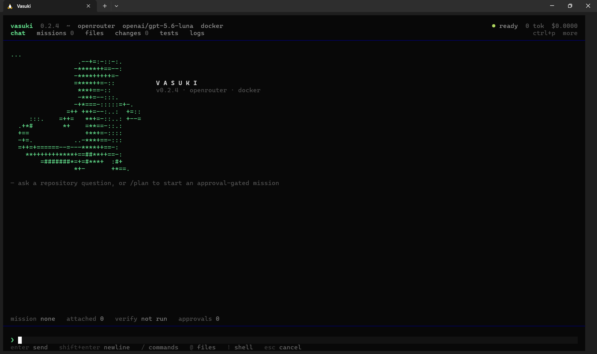

# Daino (D[AI]NO.AI)

Daino is a local-first AI coding agent that lives in your terminal. Type an instruction and it
reads the repository, edits files, runs your tests, and shows you the diff — in your working tree,
with a checkpoint taken first.

The interactive agent can also search the public web and fetch source pages for current research.
Network access follows the active approval mode and blocks private/local destinations.

The QA tab runs a complete read-only project audit: parallel architecture, security,
frontend/backend, code-quality, and UI specialists; project tests and linters; Playwright when
configured; and dependency vulnerability scans. Results are consolidated and preserved locally.

It is not a code-snippet chatbot. When you ask for a change, you get the change: the agent writes
into the files and reports what it did, rather than printing a block of code for you to paste.

Daino also has selective local memory: unfinished work survives restarts, scoped `DAINO.md`
instructions follow the files being edited, useful project facts and decisions can be retrieved in
future sessions, and source-derived facts become stale when their files change. User memory stays
under `~/.daino`; no external vector database is required. See [memory](docs/memory.md).



## Install

Python 3.12 or newer and Git. Docker is optional.

```bash
./scripts/install.sh
cd /path/to/your/repository
daino
```

This installs `daino` as a managed user application (normally `~/.local/bin/daino`). It works
from any directory and needs no virtualenv activation. Rerun the installer to upgrade, or
`uv tool uninstall daino` to remove it.

See [installation](docs/installation.md) for uv, pipx, and PATH details, or
[contributing](docs/contributing.md) for a development setup.

## Configure once

Connect a model the first time you run Daino and it is available to every project afterwards.
When a new directory is initialized, onboarding lets you inherit that global configuration or
choose a project-specific provider and model:

```bash
daino providers add openrouter \
  --type openrouter \
  --base-url https://openrouter.ai/api/v1 \
  --model openai/gpt-5.6 \
  --api-key-ref env://OPENROUTER_API_KEY
```

Providers, model profiles, and routing live in `~/.config/daino/config.yaml`. Project-local
settings — verification commands, security policy, runtime — live in `.daino/config.yaml` and
override the global layer where they disagree, so one repository can still pin a different model.
API keys for a global provider are stored under `~/.config/daino/secrets/`, never inside a
checkout. See [configuration](docs/configuration.md).

Local models work the same way and need no cloud credentials:

```bash
daino providers add local-ollama --type ollama \
  --base-url http://127.0.0.1:11434/v1 --model qwen2.5-coder:7b --local

daino providers add local-vllm --type vllm \
  --base-url http://127.0.0.1:8000/v1 --model Qwen/Qwen2.5-Coder-7B-Instruct --local
```

See [providers](docs/providers.md) for tool-calling support and structured-output behaviour per
backend.

## Using it

Type an instruction. The agent decides whether you asked a question or asked for a change:

```text
› what does landing.html do?
  daino  It renders a single welcome heading and loads styles.css.

› make the heading glassmorphism, raw CSS only
  edit  landing.html
        Added 1 line, removed 1 line
          3   <body>
          4 - <h1>Welcome</h1>
          4 + <h1 class="glass">Welcome</h1>
  daino  Applied the glass heading style.
  test    1 check(s) passed
```

Edits land in your working tree. A checkpoint is taken before the first one, so `/restore` always
has a way back, and `/diff` shows the full change.

## Browser IDE (`daino . --gui`)

Daino also ships a local, VS Code-style browser IDE driven by the **same** agent runtime as the
terminal. Nothing runs in the cloud; the server binds to `127.0.0.1` only.

```bash
daino .          # terminal UI (the default)
daino . --tui    # terminal UI, explicit
daino . --gui    # browser IDE at http://127.0.0.1:4173
daino . --gui --port 5000
```

The GUI opens your default browser to a local URL and gives you three workspaces that share one
Daino agent and one session:

- **Code** — file explorer, Monaco editor with tabs and dirty-state, an integrated terminal,
  Git status/diff, and a persistent Daino agent panel with streamed responses, tool cards, and
  command approvals (the same security model as the TUI — nothing is auto-committed).
- **Design** — structured, AI-editable diagrams (architecture, flowchart, database, API flow) on a
  React Flow canvas you can also edit by hand, plus HTML/React prototypes. Design never writes
  production code directly; use **Implement Design** to generate a plan first.
- **Preview** — runs your project's dev server (through the normal approval flow) and embeds the
  running app.

See [the GUI guide](docs/gui.md) for the full feature tour.

### The agent has a shell

It can run your tests, read the failure, fix it, and re-run — which is what turns one edit into a
loop that converges. Commands are gated by category:

| Category | Behaviour |
|---|---|
| Tests, linters, builds, `git status`, language runners | Run immediately |
| Installs, network access, `git push`, `git reset --hard` | Ask once, then remembered for the session |
| `rm -rf`, `mkfs`, `DROP DATABASE`, `terraform destroy` | Refused; not approvable |

Widen or narrow the safe set with `security.allowed_commands` and `security.denied_commands`.

### Run your own commands

A prompt beginning with `!` is a command you run yourself, through a real shell:

```text
!git status
!cat *.html | wc -l
!pytest -q
```

Its output joins the conversation, so you can run something and then ask the agent about the
result. It is never policy-gated: the gate exists to stop the *model* running something you did not
ask for.

### Teams of sub-agents

`/team <instruction>` splits work across sub-agents that run at the same time:

```text
Wave 1 (runs alone):
  survey [architect] Map the current middleware chain    scope: read-only
Wave 2 (2 members in parallel):
  limiter [builder]  Implement the rate limiter          scope: api/**
  tests   [tester]   Add rate-limit tests                scope: tests/**
```

Members sharing a wave must have non-overlapping file scopes — the roster is rejected before any
model call otherwise — and read-only members cannot write at all. A failing member does not abort
its peers. See [the TUI guide](docs/tui.md#teams-of-sub-agents).

### Approval-gated missions

For larger work, `/plan` and `/run` use the full mission workflow: requirements, an approval-gated
task plan, an isolated Git worktree, bounded repair attempts, independent review, and per-task
commits. Missions never touch your original checkout and never push.

```bash
daino run "Add a paginated GET /documents endpoint with unit tests"
daino run "Fix the authentication test" --non-interactive
daino missions list
daino missions show <mission-id> --diff
daino missions export <mission-id> --format markdown
```

## Keys and commands

`Enter` sends, `Shift+Enter` inserts a newline, `/` opens commands, `@` references files and
symbols, `!` runs a shell command, `Esc` cancels, and `Shift+Tab` cycles Plan, Ask, Session, and
Full access. Multi-step agent plans stay visible as a live checklist on the right.

Every launch starts a fresh conversation, so a new session never re-sends — or re-pays for — an
older one. Earlier sessions stay in the database and remain browsable.

The most used commands:

| Command | Purpose |
|---|---|
| `/ask <question>` | Answer without touching the repository |
| `/mode plan\|ask\|session\|full` | Set the session autonomy policy |
| `/team <instruction>` | Split work across parallel sub-agents |
| `/plan`, `/run`, `/build` | Approval-gated mission workflow |
| `/test`, `/review`, `/diff` | Verification, independent review, changes |
| `/checkpoint`, `/restore` | Create and roll back to a recovery point |
| `/model`, `/effort`, `/verbose`, `/provider`, `/globalprovider`, `/runtime` | Model and display controls |
| `/memory`, `/tasks`, `/resume` | Inspect memory and continue crash-safe work |
| `/logs`, `/map` | Follow live activity and inspect per-prompt execution graphs |

The [TUI guide](docs/tui.md) lists all of them, plus shortcuts and view details.

## Runtimes

Commands run through a runtime chosen when a project is initialized. Docker is used when the
daemon is actually reachable; otherwise the local subprocess runtime is used, so commands work out
of the box rather than failing on a container that was never available.

```bash
daino config set runtime.default local   # or docker, ssh
daino doctor                             # what works here, and why not
```

Local commands are still checked by the policy engine and run without a shell. See
[runtimes](docs/runtimes.md).

## Repository intelligence

```bash
daino repo index
daino repo symbols
daino repo references DocumentService
daino repo routes
daino repo tests
```

The index is incremental. Python symbols come from the standard AST; other supported languages use
tree-sitter declaration extraction. Only relevant exact files enter model context. See
[repository intelligence](docs/repository-intelligence.md).

## Deploy to a remote Compose server

Add a target to `.daino/config.yaml`:

```yaml
deployment:
  targets:
    production:
      type: ssh
      host: app.example.com
      username: deployer
      auth:
        key_path: ~/.ssh/id_ed25519
        known_hosts: ~/.ssh/known_hosts
      deployment_path: /opt/apps/example
      strategy: docker-compose
      compose_file: compose.yaml
      health_url: https://app.example.com/health
```

```bash
daino deploy inspect --target production
daino deploy plan --target production
daino deploy apply --target production --approve
daino deploy rollback --target production --approve
```

Inspection is read-only. Releases upload under `releases/<release-id>` and are promoted only after
Compose state and the health endpoint pass; a failed release is stopped and the previous healthy
one restored. See [deployment](docs/deployment.md).

## Security model

- Secret configuration accepts only `env://`, `keyring://`, and `file://` references. Values are
  resolved at the provider or SSH boundary and redacted from command output.
- Agent commands are allowlisted, prompted, or refused by category. Destructive patterns cannot be
  approved from a chat prompt.
- Agent file edits are scope-checked, and a whole-file overwrite of a file the agent has not read
  is refused.
- Checkpoints are taken before edits; missions run in Git worktrees. Neither pushes nor merges.
- Evidence records model selection reasons, included files, commands run, verification, review, and
  rollback points.

See [security](docs/security.md) for the trust boundaries.

## Docker development

```bash
docker build -t daino .
docker compose up -d postgres mock-llm
docker compose run --rm daino daino --help
```

## Current limitations

- Mission tasks execute one at a time. `/team` is the concurrent path, and it shares one worktree
  with disjoint file scopes rather than giving each member its own checkout.
- Long-running background processes (a dev server) are not managed; commands run to completion
  within a timeout.
- The file browser previews, searches, and selects context, but does not edit source directly.
- Restore is per checkpoint; interactive hunk-level restore is not exposed.
- Sessions are repository-local. Multi-user identity and cross-machine sync belong to a future
  Mission Control service.
- Repository parsing is deepest for Python and common JavaScript/TypeScript; an LSP adapter
  boundary is reserved but no language server is bundled.
- Compose deployment assumes an existing Linux host with Docker, Compose, directory permissions,
  and externally managed environment files, TLS, and reverse proxy.
- Kubernetes and cloud architecture generation are outside this release.

## Migrating from Vasuki

Vasuki has been renamed to **Daino**. The command is now `daino`; the old `vasuki` command still
works as a deprecated alias and prints a one-time notice.

Existing projects and sessions are detected automatically from legacy locations and never deleted:

- Project state: a new project uses `.daino/`, but a checkout that already has `.vasuki/` keeps
  using it in place, so its database, sessions, and config stay together.
- Global config/memory: `~/.config/daino` and `~/.daino` are preferred, falling back to
  `~/.config/vasuki` and `~/.vasuki` when only those exist.
- Environment variables: `DAINO_CONFIG_HOME` / `DAINO_HOME` / `DAINO_RUNTIME` are read first, with
  the `VASUKI_*` equivalents still honoured.
- Instruction files: `DAINO.md` is discovered first, and legacy `VASUKI.md` is still read where no
  `DAINO.md` exists at the same level.
- Python imports: `import daino` is canonical; `import vasuki` still resolves via a deprecation
  shim.

## Documentation

- [Architecture](docs/architecture.md)
- [Interactive TUI](docs/tui.md)
- [Browser IDE (GUI)](docs/gui.md)
- [Configuration](docs/configuration.md)
- [Providers](docs/providers.md)
- [Model routing](docs/model-routing.md)
- [Repository intelligence](docs/repository-intelligence.md)
- [Runtimes](docs/runtimes.md)
- [Deployment](docs/deployment.md)
- [Playbooks](docs/playbooks.md)
- [Security](docs/security.md)
- [Contributing](docs/contributing.md)
